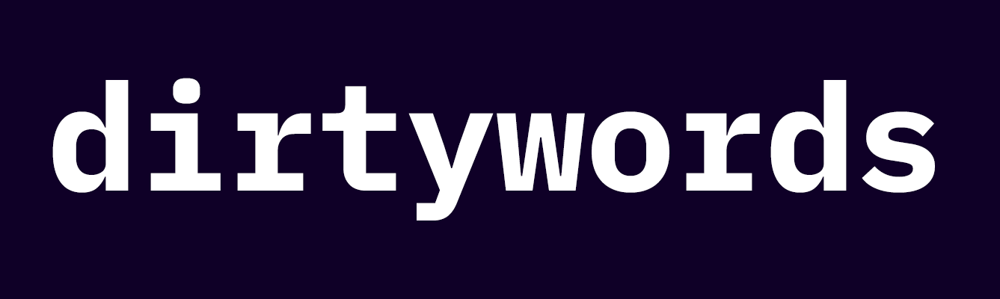

# dirtywords
[](https://opensource.org/licenses/MIT)



Inspired by [gau](https://github.com/lc/gau), dirtywords builds targeted wordlists for a given domain using "dirty" knowledge from AlienVault's Open Threat Exchange, the Wayback Machine, and Common Crawl.

https://un4gi.io/blog/introducing-dirtywords-a-targeted-word-list-generator

## Usage:

Use the `-h` flag to display available flags
```
$ dirtywords -h
```
| Flag | Description | Example |
|------|-------------|---------|
| `-d` | target domain | `dirtywords -d example.com` |
| `-minLen` | minimum word length | `dirtywords -d example.com -minLen 4` |
| `-maxLen` | maximum word length | `dirtywords -d example.com -maxLen 15` |
| `-nosubs` | ignore subdomains of target domain | `dirtywords -d example.com -nosubs` |
| `-o` | wordlist output file | `dirtywords -d example.com -o example-words.txt` | 
| `-s` | sort words uniquely (set by default) | `dirtywords -d example.com -s false` |

Example usage:
```
$ dirtywords -d example.com -nosubs -minLen 4 -maxLen 10 -o example-list.txt
```

## Installation
To install, use:
```
go get -u github.com/un4gi/dirtywords
```

## Thanks
Thank you to [@tomnomnom](https://github.com/tomnomnom) and [@lc](https://github.com/lc) for the inspiration, and thank you to [@incidrthreat](https://github.com/incidrthreat) for helping me work out the sort functionality!